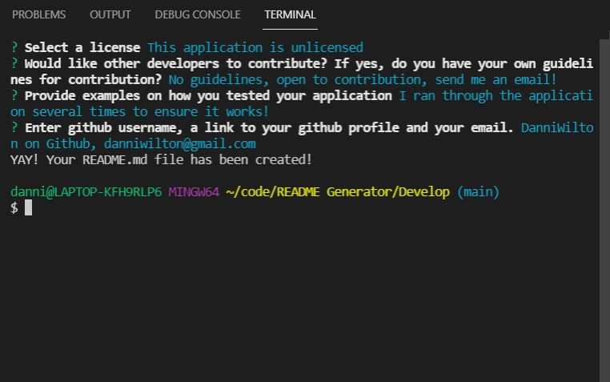
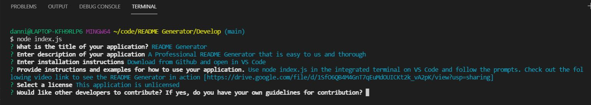

# README Generator

  ## Description:
  A professional README Generator that is easy to use and thorough

  ## Table of Contents:
  [Installation](#installation)
  [Usage](#usage)
  [License](#usage)
  [Contribution](#contributing)
  [Testing](#testing)
  [Questions](#questions)

  ### Installation 
  Download from Github and open in VS Code
  
  

  ### Usage
  Use node index.js in the integrated terminal on VS Code and follow the prompts. Check out the following video link to see the README Generator in action [here!](https://drive.google.com/file/d/1SfO6QB4M4GnT7qEuMdOUICKt2k_vA2pK/view?usp=sharing)
  
  ### Contribution
  No guidelines, open to contribution, send me an email!

  ### Testing
  I ran through the application several times to ensure it works!

  ### Questions
  DanniWilton https://github.com/DanniWilton danniwilton@gmail.com
